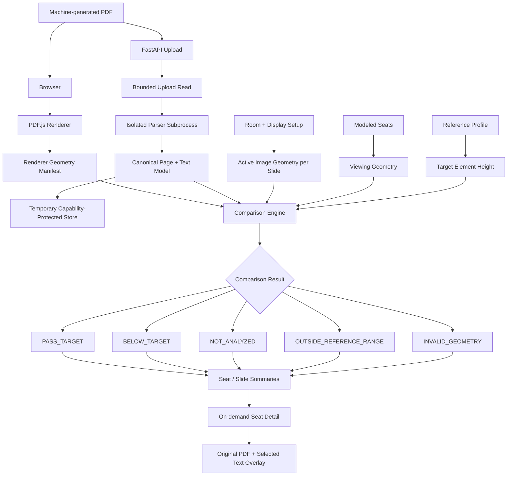

# FarSeat

> **A slide can look perfectly fine on your laptop and still demand too much from the back of the classroom.**

**FarSeat helps students and teachers review presentation text from different modeled seats before presenting.**

Upload a machine-generated PDF, describe the usable display area and seating layout, and FarSeat combines:

**presentation geometry + display geometry + seat distance**

to show which structurally analyzed text elements fall below a selected visual-demand reference target.

Every result can be traced back to the exact:

**seat → slide → text element**

so the presenter knows what deserves review.

---

## Why FarSeat exists

Presentation editors understand the **slide**.

AV tools understand the **room**.

Students experience both at the same time.

A presentation that feels comfortable while editing on a laptop may create very different visual demands when:

- the projected image is physically small,
- a slide is letterboxed,
- a student sits farther from the display,
- or important text occupies only a small physical height on screen.

Font size alone does not describe the whole viewing situation.

FarSeat connects the presentation to the room.

---

## The school-life problem

Presentations are part of everyday school life:

- classroom lessons,
- student projects,
- group presentations,
- club meetings,
- science fairs,
- assemblies,
- workshops,
- and school events.

Presenters normally design slides while sitting close to a laptop.

The audience does not.

FarSeat gives a presenter a practical question to ask before presenting:

> **Which parts of this presentation deserve another look for students sitting farther away?**

FarSeat does not replace the teacher, student, or designer.

It gives them better evidence for reviewing their slides.

---

# What FarSeat does

## 1. Upload a presentation

FarSeat accepts a machine-generated PDF.

V1 supports PDFs up to:

- **20 MiB**
- **75 pages**

Additional safe-processing limits apply to extracted characters, logical text runs, serialized models, and parser execution.

---

## 2. Describe the room

Configure:

- usable display dimensions,
- presentation/display geometry,
- and modeled audience seats.

FarSeat supports up to **200 modeled seats**.

---

## 3. Analyze the presentation

FarSeat:

1. structurally parses supported text from the PDF;
2. models the active image displayed for each slide;
3. accounts for slide/display aspect-ratio letterboxing;
4. models each seat relative to the display plane;
5. determines the applicable visual-demand reference target;
6. compares structural text height against that target.

---

## 4. Inspect the result

FarSeat does not stop at:

> “Slide 4 may need review.”

A result can be traced through:

```text
modeled seat
    ↓
slide
    ↓
specific text element
    ↓
measured structural geometry
    ↓
reference comparison
```

The original PDF is rendered locally with PDF.js and the selected text region is overlaid on the slide.

That makes the result inspectable instead of mysterious.

---

# Result states

FarSeat deliberately distinguishes different kinds of outcomes.

| Result | Meaning |
|---|---|
| `PASS_TARGET` | The analyzed element meets the selected reference target for the modeled condition. |
| `BELOW_TARGET` | The analyzed element falls below the selected reference target. |
| `NOT_ANALYZED` | FarSeat cannot make the represented measurement safely for this content. |
| `OUTSIDE_REFERENCE_RANGE` | The modeled condition is outside the encoded reference range. |
| `INVALID_GEOMETRY` | Required geometry is invalid or unsupported. |

The central rule is:

> **Unknown never becomes pass.**

Unsupported or uncertain content does not receive a fabricated successful result.

---

# 60-second judge path

The repository includes a project-owned demonstration PDF:

```text
frontend/public/farseat-demo.pdf
```

It contains examples of:

- ordinary presentation text,
- deliberately small text,
- mixed text sizes,
- an ultra-wide slide,
- and an image-only slide.

A simple evaluation path is:

1. Upload the demo PDF.
2. Enter the display dimensions.
3. Add modeled classroom seats.
4. Run the analysis.
5. Compare a nearer seat with a farther seat.
6. Open a flagged slide.
7. Select a text element.
8. See the exact region highlighted on the original PDF.
9. Inspect the image-only slide and notice that unsupported content becomes `NOT_ANALYZED`, not an invented green result.

The key idea is simple:

> **The same slide can create different visual demands from different seats.**

---

# Why FarSeat is different

## Presentation tools usually know the document

They know:

- text,
- fonts,
- slide dimensions,
- layouts.

But they usually do not know the physical room.

---

## Room tools usually know the environment

They may know:

- display dimensions,
- viewing distances,
- room geometry.

But they usually do not know the actual structural geometry of every text element in the presentation.

---

## FarSeat connects the two

```text
Presentation
      +
Displayed image size
      +
Room geometry
      +
Seat location
      +
Reference profile
      ↓
Seat-specific review result
```

That lets FarSeat answer a more useful question than:

> “What font size did I use?”

It asks:

> **What physical visual demand does this specific text create from this modeled seat?**

---

# Architecture



The analysis matrix is factorized.

FarSeat does not persist millions of element × seat result objects.

Compact summaries are produced first, while detailed seat information is retrieved on demand.

---

# How the analysis works

## Structural PDF analysis

FarSeat works with supported text from machine-generated PDFs.

It does **not** use OCR in V1.

The parser captures structural information including:

- page geometry,
- text geometry,
- text rendering mode,
- transparency state,
- supported clipping state,
- page rotation,
- visible text structure.

These checks help prevent invisible, unsupported, or uncertain content from masquerading as valid visible text.

---

## Display modeling

A display's physical dimensions are not always the dimensions of the active slide image.

Different slide aspect ratios can create letterboxing.

FarSeat therefore computes the active displayed image separately for each slide.

That active image geometry is what participates in the viewing calculation.

---

## Seat modeling

FarSeat supports up to **200 modeled seats**.

Seats are modeled using perpendicular distance to the display plane.

This allows the same text element to produce different comparison outcomes for different modeled viewing positions.

---

## Reference comparison

FarSeat V1 includes:

```text
PUBLIC_AVIXA_BDM_REFERENCE_V1
```

This repository encodes the publicly available Basic Decision Making viewing-ratio / element-height reference table.

FarSeat applies a conservative higher-target policy at shared interval boundaries.

The encoded reference data is located in:

```text
validation/reference/PUBLIC_AVIXA_BDM_REFERENCE_V1.json
```

and the corresponding backend implementation is in:

```text
backend/app/reference.py
```

This is a **reference profile**.

FarSeat does not claim implementation or certification of the complete current ANSI/AVIXA standard.

---

# Fail-closed design

FarSeat separates several questions that would be dangerous to collapse into one green/red result:

1. Is the page geometry trusted?
2. Is the content structurally analyzable?
3. Is the measurement supported?
4. Is the modeled seat geometry valid?
5. Is the selected reference applicable?
6. How much of the presentation was actually analyzed?

Unsupported or uncertain content does not receive a fabricated structural measurement.

Geometry disagreements between backend parsing and browser rendering become `NOT_ANALYZED` rather than a plausible-looking pass.

---

# Supported in V1

FarSeat is designed for:

- machine-generated PDFs,
- extractable text,
- supported horizontal text,
- validated left-to-right text geometry,
- normal PDF page rotations of:
  - 0°
  - 90°
  - 180°
  - 270°.

---

# Deliberately not analyzed in V1

FarSeat does not claim support for:

- image-only or scanned slides,
- OCR-dependent text,
- handwriting,
- arbitrary rotated text,
- unsupported writing directions,
- unsupported text shaping,
- complex clipping paths,
- optional-content/layered PDF behavior outside the validated path,
- ambient room lighting,
- projector contrast,
- display brightness,
- individual eyesight,
- or medical vision.

Unsupported conditions are surfaced as limitations or `NOT_ANALYZED`.

They are not silently treated as successful analysis.

---

# What FarSeat does not claim

FarSeat is a **review tool**, not a certification product.

It does not claim:

- that an individual student can or cannot read a slide;
- individual readability;
- WCAG compliance;
- accessibility certification;
- AVIXA certification;
- medical or vision assessment;
- complete analysis of arbitrary PDF content.

The project's claim is intentionally narrower:

> **FarSeat shows which structurally analyzed presentation text elements fall below a selected visual-demand reference target from different modeled seats.**

---

# Privacy and security

FarSeat was designed so that a classroom presentation does not need to become a permanent cloud record.

## No accounts

V1 has no user-account system.

## No database

Presentation and analysis state is held temporarily in process memory.

## Short-lived sessions

Presentation and analysis objects expire after approximately **30 minutes**.

Restarting the backend also clears them.

The default store supports:

- up to **8 presentations**
- up to **24 analysis snapshots**

and rejects new work at capacity rather than silently evicting an active session.

---

## Capability-based access

After upload, the browser receives a random presentation capability.

Subsequent presentation and analysis access requires that capability in:

```text
X-FarSeat-Token
```

IDs alone do not grant access.

Capability tokens:

- are never placed in URLs;
- are returned once to the browser;
- are stored server-side only as SHA-256 digests.

Missing or incorrect capabilities receive non-disclosing access errors.

---

## Bounded upload processing

FarSeat applies multiple defensive limits.

The application limits:

- PDF file size,
- page count,
- extracted characters,
- logical text runs,
- serialized model size,
- concurrent uploads,
- parser wall-clock time,
- parser memory use.

The included nginx configuration applies a **21 MiB HTTP request-body limit**.

FarSeat separately applies a **20 MiB PDF-file limit** after multipart handling.

The difference leaves room for multipart framing.

---

## Isolated parsing

PDF parsing executes inside a spawned subprocess.

That prevents pathological input from consuming the main API process indefinitely.

Parent/child communication uses a concurrently drained one-way pipe so large valid parsed models do not deadlock behind an IPC buffer.

---

# API

The main endpoints are:

```text
POST /api/presentations
```

Upload a PDF.

```text
GET /api/presentations/{presentation_id}
```

Retrieve presentation information using the capability token.

```text
DELETE /api/presentations/{presentation_id}
```

Delete a presentation/session object.

```text
POST /api/analyze
```

Run analysis using:

- display geometry,
- room geometry,
- modeled seats,
- reference profile,
- and the PDF.js renderer manifest.

```text
GET /api/analyses/{analysis_id}/seats/{seat_id}
```

Retrieve immutable on-demand seat detail.

The FastAPI OpenAPI document is available from a running backend at:

```text
/openapi.json
```

---

# Demo fixture

FarSeat includes a six-slide project-owned demo fixture:

```text
frontend/public/farseat-demo.pdf
```

Structural expectations are hand-authored in:

```text
sample/farseat-demo.expected.json
```

Expected results are not generated from production code.

That keeps the demonstration fixture independent from the analysis implementation it is intended to exercise.

---

# Tech stack

## Frontend

- React
- TypeScript
- Vite
- Tailwind CSS
- PDF.js

## Backend

- Python 3.12+
- FastAPI
- Pydantic
- pdfplumber
- pdfminer.six

## Validation

- Pytest
- Vitest
- Playwright Chromium
- TypeScript/Vite production build
- GitHub Actions
- source-bound release validation

## Deployment

- Docker
- Docker Compose
- nginx
- Uvicorn

---

# Repository structure

```text
FarSeat/
├── backend/
│   ├── app/                     # FastAPI application and analysis logic
│   └── tests/                   # Backend regression tests
│
├── frontend/
│   ├── src/                     # React + TypeScript interface
│   └── public/
│       └── farseat-demo.pdf     # Project-owned demo fixture
│
├── scripts/
│   ├── browser_e2e.py           # Playwright browser release gate
│   └── validate_release.py      # Exact-source release validation
│
├── sample/
│   └── farseat-demo.expected.json
│
├── validation/
│   ├── reference/
│   │   └── PUBLIC_AVIXA_BDM_REFERENCE_V1.json
│   ├── reports/
│   ├── RELEASE_GATE.md
│   └── defect-ledger.json
│
├── .github/
│   └── workflows/
│       └── ci.yml
│
├── docker-compose.yml
└── README.md
```

---

# Run locally

## Requirements

- Python **3.12+**
- Node.js / npm

---

## Backend

From the repository root:

```bash
cd backend
python -m venv .venv
```

Activate the environment.

### Windows PowerShell

```powershell
.venv\Scripts\Activate.ps1
```

### macOS / Linux

```bash
source .venv/bin/activate
```

Install dependencies:

```bash
pip install -e ".[dev]"
```

Start the backend:

```bash
uvicorn app.main:app --reload --workers 1 --port 8000
```

---

## Frontend

Open another terminal:

```bash
cd frontend
npm ci
npm run dev
```

Then open:

```text
http://localhost:5173
```

The frontend uses same-origin `/api` by default.

During development, Vite proxies:

```text
/api
/health
```

to:

```text
http://localhost:8000
```

Set `VITE_API_BASE` only when intentionally using a separate API origin.

---

# Docker deployment

The repository includes a deployment path using:

- nginx,
- built Vite frontend,
- and a single-worker FastAPI backend.

Run:

```bash
docker compose up --build
```

Then open:

```text
http://localhost:8080
```

nginx serves the frontend and proxies:

```text
/api
/health
```

to the backend.

The single-worker requirement is intentional because FarSeat V1 uses a process-local ephemeral capability store.

---

# Tests

## Backend

```bash
cd backend
python -m pytest -q
```

---

## Release-only parser resource suite

```bash
python -m pytest -q -m resource tests/test_resource_release.py
```

---

## Frontend tests and production build

```bash
cd ../frontend
npm ci
npm test -- --run
npm run build
```

---

# Browser end-to-end validation

FarSeat includes a Playwright Chromium browser gate:

```text
scripts/browser_e2e.py
```

It exercises the browser workflow against the running frontend and backend.

Browser evidence is tied to the source commit used for validation.

---

# Release validation

From the repository root:

```bash
python scripts/validate_release.py
```

The release validator checks more than whether commands return zero.

A release gate is not considered passing when required evidence is:

- missing,
- stale,
- skipped,
- zero-test,
- crashed,
- source-mismatched,
- or generated from a dirty source tree.

It also verifies that closed high-priority defect-ledger entries continue to reference existing regression evidence.

Generated validation reports and screenshots are release artifacts rather than application source.

For release-candidate evaluation, also review:

```text
validation/RELEASE_GATE.md
validation/defect-ledger.json
validation/reports/
```

---

# AI-use disclosure

AI-assisted development tools were used during FarSeat's development for tasks including:

- brainstorming,
- architecture review,
- debugging,
- code review,
- edge-case analysis,
- testing strategy,
- and documentation assistance.

AI does **not** decide FarSeat's runtime comparison results.

The runtime analysis is based on deterministic processing of:

- PDF structure,
- structural text geometry,
- display geometry,
- modeled seat geometry,
- and the selected reference profile.

The final project behavior, implementation decisions, validation, and understanding remain the responsibility of the project author.

---

# Current project status

FarSeat **v1.0.3** is a hardened release candidate.

It is not presented as:

- a readability certification product,
- an accessibility certification product,
- a medical assessment,
- or an AVIXA-certified system.

Release qualification is intentionally tied to an exact clean source commit.

A checkout should be described as release-verified only when the complete release gate passes for that exact commit.

---

# Limits and future work

FarSeat intentionally keeps V1 narrow.

Possible future work includes:

- carefully qualified support for additional writing systems;
- validated handling of more complex PDF content;
- additional room-modeling options;
- richer classroom layout tools;
- broader presentation-authoring integrations;
- further independent evaluation of the reference-comparison workflow.

Any expansion should preserve the current principle:

> **Unsupported evidence should remain visible as uncertainty rather than being converted into a confident result.**

---

# The idea in one sentence

> **Presentation tools understand the slide. AV tools understand the room. FarSeat connects the two so presenters can review what their slides demand from different seats before the presentation begins.**

---

## License

MIT
